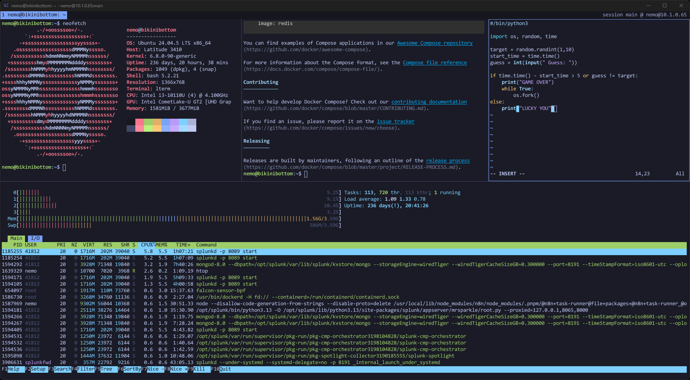
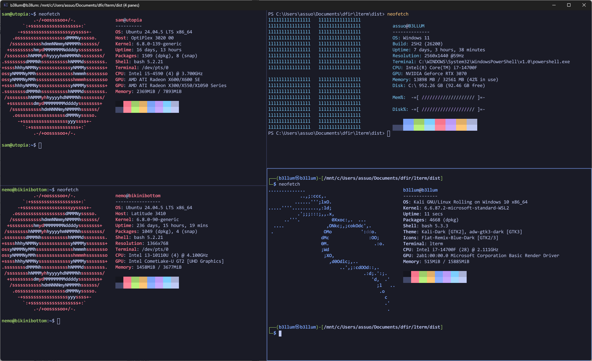
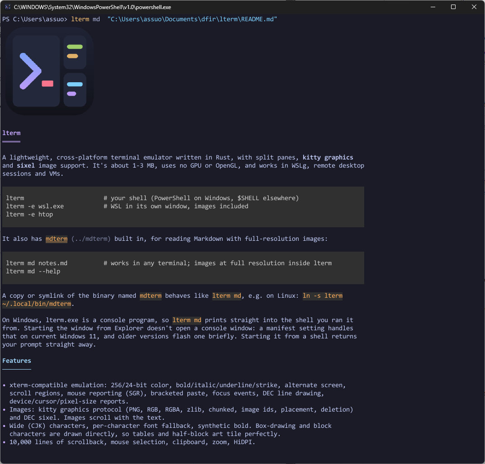

<p align="center"></p>

# lterm

A small, fast terminal for Windows and Linux with splits, tabs, tmux-style sessions and inline images.



| Splits across machines | Markdown with images |
|---|---|
|  |  |

## Install

Download from [Releases](https://github.com/b-3llum/lterm/releases/latest), then run:

```
lterm install            # adds lterm to your PATH and app menu (no admin needed)
```

On Windows, unzip `lterm-windows-x86_64.zip` and run `lterm.exe install` from that folder.
On Linux, run `chmod +x lterm-linux-x86_64 && ./lterm-linux-x86_64 install`.

## Use

```
lterm                          # open a terminal
lterm -e wsl.exe               # run something else instead of your shell (new panes run it too)
lterm md notes.md              # read Markdown with images
lterm keys                     # list every shortcut
```

### Work on a server

```
lterm push user@server         # 1. install lterm there (asks first, one password prompt)
lterm --attach user@server     # 2. connect. Split and add tabs freely, with no new logins
```

- **Detach:** press `Ctrl+Space d` or close the window. Everything keeps running.
- **Come back:** run the same `--attach` command. Your tabs, splits and scrollback are restored.
- **Connection dropped?** Press `Ctrl+Space r` to reconnect.
- **Several sessions:** add `-s NAME` (for example `-s logs`). On the server, `lterm ls` lists them and `lterm kill NAME` ends one.
- **On Windows,** `lterm --attach wsl` does the same with shells inside WSL.

## Shortcuts

Press **Ctrl+Space**, let go, then press a key. **F1** shows every shortcut in the window.

| After Ctrl+Space | Action | After Ctrl+Space | Action |
|---|---|---|---|
| `v` / `s` | split right / down | `t` | new tab |
| `h j k l` or arrows | move between panes | `n` / `p` | next / previous tab |
| `H J K L` | resize (tap again to repeat) | `1`–`9` | go to tab |
| `o` | next pane | `w` | close tab |
| `z` | zoom pane / restore | `c` | copy mode |
| `x` | close pane | `/` | search scrollback |
| `?` | help | `d` / `r` | detach / reconnect |

**Without the leader:**

| Keys | Action |
|---|---|
| Ctrl+Shift+E / O | split right / down |
| Alt+Arrows / Alt+Shift+Arrows | move between / resize panes |
| Ctrl+Shift+T, Ctrl+Tab, Alt+1–9 | new tab, next tab, go to tab |
| Ctrl+Shift+W / Z | close / zoom pane |
| Ctrl+Shift+C / V | copy / paste (right-click also copies or pastes) |
| Ctrl+Shift+F | search scrollback |
| Ctrl+Shift+= / - / 0 | font size bigger / smaller / reset |
| Shift+PageUp / PageDown | scroll history (or use the mouse wheel) |

**Copy mode** (`Ctrl+Space c`): move with `h j k l`, `w b`, `0 $` and `g G`. Press `v` (characters) or `V` (lines) to select, `y` to copy, `/` to search, `n` / `N` for the next / previous match, and `q` to quit.

**Mouse:** click a pane to focus it, drag to select, and Shift+drag to select inside programs like vim or htop.

**Different leader?** Use `lterm --leader ctrl+a` (or `alt+space`, `f12`), or set `LTERM_LEADER`.

## Notes

- **SSH:** password and host prompts appear in a small window, and nothing is saved.
  Use `LTERM_SSH="ssh -p 2222"` for custom ssh options.
- **Windows images** need `conpty.dll` and `OpenConsole.exe` next to `lterm.exe`
  (included in the Windows zip, from Microsoft's MIT-licensed ConPTY package).
- **Linux build** needs glibc 2.39 or newer (Ubuntu 24.04+, Debian 13+). On older systems, build from source.
- **Build:** `cargo build --release`. For Windows from Linux, add `--target x86_64-pc-windows-gnu`.
