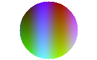

# mdterm demo

Renders **bold**, *italic*, ~~strikethrough~~, `inline code` and
[links](https://example.com) straight to the terminal. Long paragraphs are
word-wrapped to the terminal width, including wide characters like 日本語.

## Lists

- First item
- Second item with a nested list
  - nested *one*
  - nested two
- [x] finished task
- [ ] open task

1. ordered
2. list

## Code

```rust
fn main() {
    println!("hello, terminal");
}
```

## Table

| Tool    | Platform        | Images |
|:--------|:---------------:|-------:|
| mdterm  | Linux/macOS/Win |    yes |
| cat     | everywhere      |     no |

> A block quote can span several lines and is wrapped
> along with its bar.

> [!WARNING]
> GitHub-style alerts are supported too.

## Image




---

Footnotes work[^1].

[^1]: Like this one.
